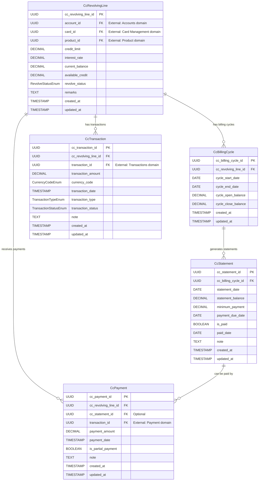

# Core Lending Credit Cards Service

A reactive microservice for managing credit card revolving lines, billing cycles, statements, transactions, and payments as part of the **Firefly OpenCore Banking Platform**.

## About Firefly

This microservice is developed by **Firefly Software Solutions Inc** as part of the Firefly OpenCore Banking Platform - a comprehensive, cloud-native banking solution designed for modern financial institutions.

- **Website**: [getfirefly.io](https://getfirefly.io)
- **GitHub Organization**: [firefly-oss](https://github.com/firefly-oss)
- **License**: Apache 2.0

## Overview

The Core Lending Credit Cards Service provides comprehensive credit card management capabilities including:

- **Credit Card Revolving Lines**: Manage credit limits, balances, and account status
- **Billing Cycles**: Track monthly billing periods and balance calculations
- **Statement Generation**: Create and manage monthly statements with payment due dates
- **Transaction Processing**: Handle purchases, cash advances, fees, interest, and payments
- **Payment Management**: Process payments against statements or revolving balances

## Architecture

This service follows a **reactive, hexagonal architecture** pattern with clear separation of concerns:

- **Reactive Programming**: Built with Spring WebFlux for non-blocking, high-performance operations
- **Database Access**: Uses R2DBC for reactive PostgreSQL database operations
- **API Documentation**: Integrated OpenAPI 3.0/Swagger for comprehensive API documentation
- **Modular Design**: Clean separation between interfaces, business logic, data models, and web layers
- **UUID-based Identifiers**: All entities use UUID primary keys for distributed system compatibility

## Module Structure

### 🔌 core-lending-credit-cards-interfaces
**Contracts and Data Transfer Objects**
- DTOs with comprehensive validation annotations
- Enums for standardized values (transaction types, statuses, currencies)
- Service interface definitions
- Custom validation annotations

### 🗄️ core-lending-credit-cards-models
**Data Layer and Persistence**
- JPA entity classes mapped to PostgreSQL tables
- R2DBC repository interfaces for reactive data access
- Flyway database migration scripts
- Database schema definitions with UUID support

### ⚙️ core-lending-credit-cards-core
**Business Logic and Services**
- Service implementations with business rules
- Entity-DTO mappers using MapStruct
- Transaction management and validation
- Credit limit and balance calculations

### 🌐 core-lending-credit-cards-web
**REST API and Web Layer**
- Reactive REST controllers with Spring WebFlux
- OpenAPI configuration and documentation
- Application configuration and startup
- Error handling and validation

### 📦 core-lending-credit-cards-sdk
**API Specification and Client Generation**
- OpenAPI 3.0 specification (YAML)
- Generated client libraries
- API documentation and examples

## Data Model

The service manages five core entities with the following relationships:

### Core Entities

1. **CcRevolvingLine** - Credit card account with credit limit and balance tracking
2. **CcBillingCycle** - Monthly billing periods for each revolving line
3. **CcStatement** - Generated statements for each billing cycle
4. **CcTransaction** - Individual transactions (purchases, fees, interest, etc.)
5. **CcPayment** - Payments made against revolving lines or statements

### Enumerations

- **RevolveStatusEnum**: `ACTIVE`, `BLOCKED`, `CLOSED`, `DEFAULT`, `SUSPENDED`, `OVERLIMIT`
- **TransactionTypeEnum**: `PURCHASE`, `CASH_ADVANCE`, `FEE`, `INTEREST`, `REFUND`, `CREDIT`, `PAYMENT`
- **TransactionStatusEnum**: `AUTHORIZED`, `POSTED`, `REVERSED`, `DECLINED`, `PENDING`
- **CurrencyCodeEnum**: `EUR`, `USD`, `GBP`, `CHF`

## Entity Relationship Diagram



## API Endpoints

### Credit Card Revolving Lines
- `GET /api/v1/cc-revolving-lines` - List/search revolving lines with filtering
- `POST /api/v1/cc-revolving-lines` - Create a new revolving line
- `GET /api/v1/cc-revolving-lines/{id}` - Get revolving line by ID
- `PUT /api/v1/cc-revolving-lines/{id}` - Update revolving line
- `DELETE /api/v1/cc-revolving-lines/{id}` - Delete revolving line

### Billing Cycles
- `GET /api/v1/cc-revolving-lines/{id}/billing-cycles` - List billing cycles for a revolving line
- `POST /api/v1/cc-revolving-lines/{id}/billing-cycles` - Create new billing cycle
- `GET /api/v1/billing-cycles/{id}` - Get billing cycle by ID
- `PUT /api/v1/billing-cycles/{id}` - Update billing cycle
- `DELETE /api/v1/billing-cycles/{id}` - Delete billing cycle

### Statements
- `GET /api/v1/billing-cycles/{id}/statements` - List statements for a billing cycle
- `POST /api/v1/billing-cycles/{id}/statements` - Create new statement
- `GET /api/v1/statements/{id}` - Get statement by ID
- `PUT /api/v1/statements/{id}` - Update statement
- `DELETE /api/v1/statements/{id}` - Delete statement

### Transactions
- `GET /api/v1/cc-revolving-lines/{id}/transactions` - List transactions for a revolving line
- `POST /api/v1/cc-revolving-lines/{id}/transactions` - Create new transaction
- `GET /api/v1/transactions/{id}` - Get transaction by ID
- `PUT /api/v1/transactions/{id}` - Update transaction
- `DELETE /api/v1/transactions/{id}` - Delete transaction

### Payments
- `GET /api/v1/cc-revolving-lines/{id}/payments` - List payments for a revolving line
- `POST /api/v1/cc-revolving-lines/{id}/payments` - Create new payment
- `GET /api/v1/payments/{id}` - Get payment by ID
- `PUT /api/v1/payments/{id}` - Update payment
- `DELETE /api/v1/payments/{id}` - Delete payment

## Technology Stack

### Core Technologies
- **Java 21** - Latest LTS version with virtual threads support
- **Spring Boot 3.x** - Application framework with reactive support
- **Spring WebFlux** - Reactive web framework for non-blocking operations
- **Spring Data R2DBC** - Reactive database access layer
- **PostgreSQL** - Primary database with UUID and enum support

### Development Tools
- **Maven** - Build automation and dependency management
- **Flyway** - Database migration and versioning
- **Lombok** - Code generation for reducing boilerplate
- **MapStruct** - Type-safe bean mapping
- **OpenAPI 3.0** - API specification and documentation
- **Jakarta Validation** - Bean validation with custom validators

## Getting Started

### Prerequisites
- Java 21 or higher
- Maven 3.8 or higher
- PostgreSQL 12 or higher
- Docker (optional, for containerized deployment)

### Environment Variables
```bash
DB_HOST=localhost
DB_PORT=5432
DB_NAME=firefly_credit_cards
DB_USERNAME=firefly_user
DB_PASSWORD=firefly_password
DB_SSL_MODE=disable
SERVER_ADDRESS=localhost
SERVER_PORT=8080
```

### Building the Service
```bash
# Clone the repository
git clone https://github.com/firefly-oss/core-lending-credit-cards.git
cd core-lending-credit-cards

# Build all modules
mvn clean install

# Run tests
mvn test
```

### Running the Service
```bash
# Using Maven
mvn spring-boot:run -pl core-lending-credit-cards-web

# Using JAR file
java -jar core-lending-credit-cards-web/target/core-lending-credit-cards-web-1.0.0-SNAPSHOT.jar
```

### API Documentation
Once running, access the interactive API documentation:
- **Local**: http://localhost:8080/swagger-ui.html
- **Development**: http://core.catalis.vc/credit-cards/swagger-ui.html

## Database Schema

The service uses PostgreSQL with the following features:
- **UUID Primary Keys**: All entities use UUID for distributed system compatibility
- **Custom Enums**: Database-level enums for type safety
- **Audit Fields**: Created/updated timestamps on all entities
- **Foreign Key Constraints**: Referential integrity enforcement
- **Flyway Migrations**: Version-controlled schema evolution

### Migration Scripts
- `V1__Create_Enums.sql` - Database enum types
- `V2__Create_Tables.sql` - Core table structures
- `V3__Create_Casts.sql` - Enum casting for R2DBC compatibility
- `V4__Convert_IDs_To_UUID.sql` - UUID migration from BIGINT

## Integration Points

This service integrates with other Firefly platform services:

- **Accounts Service**: Account ownership and customer information
- **Card Management Service**: Physical/virtual card details and status
- **Product Service**: Credit card product definitions and terms
- **Transactions Service**: Core transaction processing and authorization
- **Payment Service**: Payment processing and settlement

## Development Guidelines

### Adding New Features
1. **Define DTOs** in `core-lending-credit-cards-interfaces`
2. **Create Entities** in `core-lending-credit-cards-models`
3. **Implement Services** in `core-lending-credit-cards-core`
4. **Add Controllers** in `core-lending-credit-cards-web`
5. **Update OpenAPI** specification in `core-lending-credit-cards-sdk`

### Code Quality
- Comprehensive validation using Jakarta Validation
- Reactive programming patterns with Mono/Flux
- Proper error handling and logging
- Unit and integration test coverage
- OpenAPI documentation for all endpoints

## License

This project is licensed under the **Apache License 2.0** - see the [LICENSE](LICENSE) file for details.

---

**Firefly Software Solutions Inc** | Building the future of banking technology
